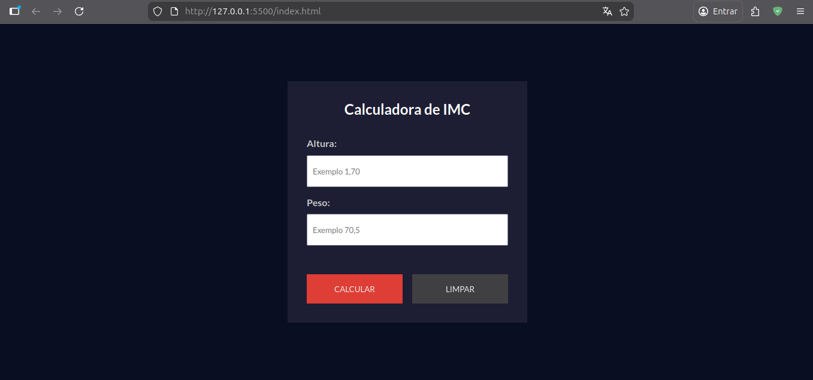
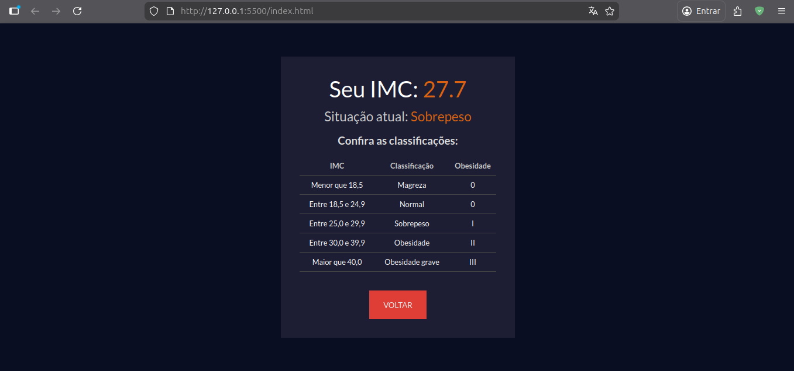

# BMI Calculator

A web-based Body Mass Index (BMI) calculator built with pure HTML, CSS, and JavaScript. This project allows users to calculate their BMI by entering their height and weight and provides a detailed classification of their nutritional status.

## 🚀 Technologies

This project was developed using the following technologies:

- **HTML5**: Semantic structure of the application.
- **CSS3**: Modern styling with custom fonts (Lato) and a responsive design.
- **JavaScript**: Core logic for BMI calculation, input validation, and DOM manipulation.
- **Google Fonts**: Integrated "Lato" font for improved typography.

---

## 📸 Previews


_Initial input screen._


_Calculation results and classification table._

---

## 📂 Project Structure

Below is the file and folder structure of the project:

```text
.
├── assets
│   ├── css
│   │   └── styles.css
│   └── js
│       └── scripts.js
├── index.html
└── README.md
```

---

## 💻 How to Run

### Prerequisite

To run this project, you just need a modern web browser installed on your machine.

### Cloning the Project

First, clone the repository to your local machine:

```bash
git clone https://github.com/alexandrerogeriosn93/project-html-css-js-imc-calculator.git
```

### Running the Project

#### Option 1: Without Live Server (Manual)

1. Navigate to the project folder.
2. Locate the `index.html` file.
3. Open `index.html` in your favorite web browser (double-click it or drag and drop into the browser).

#### Option 2: With Live Server (Recommended)

If you are using **Visual Studio Code**:

1. Open the project folder in VS Code.
2. Ensure the [Live Server](https://marketplace.visualstudio.com/items?itemName=ritwickdey.LiveServer) extension is installed.
3. Click on the **"Go Live"** button at the bottom right corner of the editor, or right-click `index.html` and select **"Open with Live Server"**.
4. The project will automatically open in your default browser at `http://127.0.0.1:5500/`.
